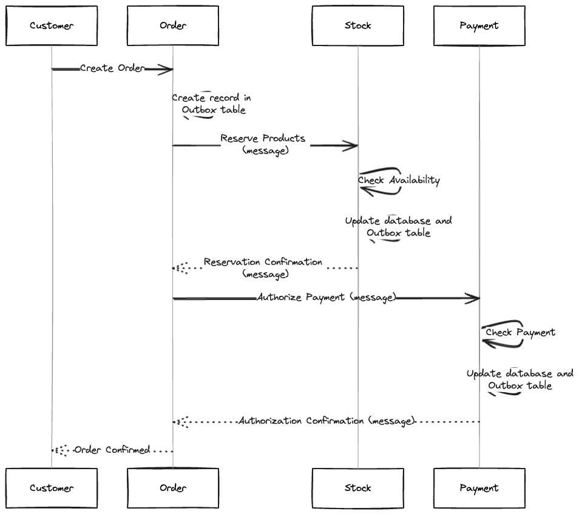

# Saga with Outbox Pattern

[](README.md)
[](README.pt-br.md)
[](LICENSE)

A compact demonstration of the **Outbox Pattern** and **Saga orchestration** across three Django microservices — **Order**, **Stock**, and **Payment** — built on the [django-outbox-pattern](https://github.com/juntossomosmais/django-outbox-pattern) library.



## What's inside

| | |
|---|---|
| **Services** | Order, Stock, Payment (Django + PostgreSQL each) |
| **Messaging** | RabbitMQ with outbox-based publishing |
| **Gateway** | Kong API gateway |
| **Runtime** | Docker Compose or Kubernetes (k3d + Helm) |
| **Frontend** | Next.js demo app in [`web/`](web) |

## Quick start (Docker)

```bash
cd docker
./scripts/start.sh
```

| Endpoint | URL |
|---|---|
| Order admin | http://localhost:8000/admin |
| Stock admin | http://localhost:8001/admin |
| Payment admin | http://localhost:8002/admin |
| API | http://localhost:8080 |
| RabbitMQ UI | http://localhost:15672 |

Credentials: Django `admin/admin`, RabbitMQ `guest/guest`.

Stop with `./scripts/stop.sh`.

## Quick start (Kubernetes)

```bash
cd k8s
./setup.sh   # installs k3d/kubectl/Helm and creates the "saga" cluster
```

Then follow the full guide in [README.md](README.md) for Kong, RabbitMQ, and the Helm installs:

```bash
helm install order  ./saga --values services/order/values.yaml
helm install stock  ./saga --values services/stock/values.yaml
helm install payment ./saga --values services/payment/values.yaml
```

## Testing

Import [`docs/saga.postman_collection.json`](docs/saga.postman_collection.json) into Postman and run the scenarios:

- **Unreserved stock** — order quantity > 10
- **Denied payment** — order amount > $1000

## Documentation

- Full setup guide: [README.md](README.md)
- Guia em português: [README.pt-br.md](README.pt-br.md)
- Architecture diagram: [`docs/architecture.png`](docs/architecture.png)

## License

MIT — see [LICENSE](LICENSE).
